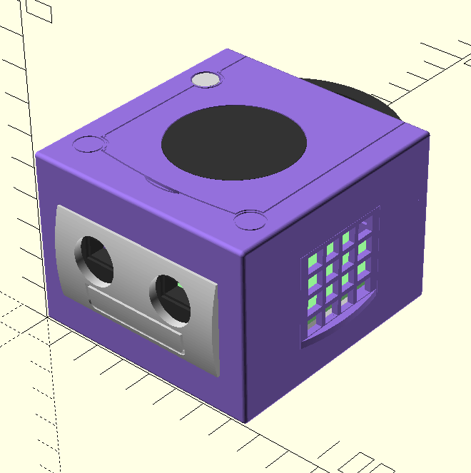

# half-gamecube

It's a (precisely) half-sized gamecube. With half the controller ports (as USB) and half the memory card slots (as useless). It's got a raspberry pi 3A+ in it, with a USB port hardwired in so that I could have two ports in the front instead of one on the side.

## Render

## Actual Pics

`todo`

## Why?

See above
